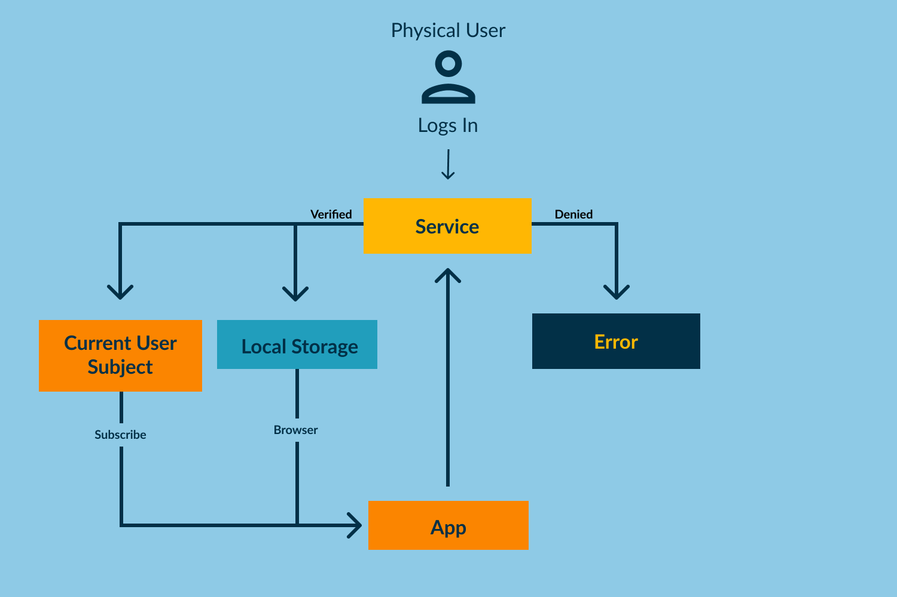

# State Management with Services & Local Storage
<hr />

**Rundown**
Instead of NGRX, we will use a collection of services and your browser's local storage to handle the
state manegement. 
We have a user and we send the user's data to the local storage so that it can be cached. Then when the 
app is running on a server it is able to access that to know if the user is logged in, to know the user's 
information, and more.

**The Flow**
When our user logs in, the data from the database is found through the user service(where the login, logout, etc. logic is found)
Then it takes that information to a local storage service that send the data to the browser's local storage.
It is then able to be seen by the app.

## State Management Flow Chart

<hr />

# Step 1: Create a Basic layout for our App
- Generate a component for a nav bar inside a shared folder
- We use bootstrap 5 in this project
- Grab the bootstrap five navbar
- Change it to look like this:
  ```html
    <nav class="navbar navbar-expand-lg navbar-dark bg-dark">
      <div class="container-fluid">
        <a class="navbar-brand" href="#"
          >State Management with Services & Local Storage</a
        >
        <button
          class="navbar-toggler"
          type="button"
          data-bs-toggle="collapse"
          data-bs-target="#navbarSupportedContent"
          aria-controls="navbarSupportedContent"
          aria-expanded="false"
          aria-label="Toggle navigation"
        >
          <span class="navbar-toggler-icon"></span>
        </button>
        <div
          class="collapse navbar-collapse"
          id="navbarSupportedContent"
        >
          <ul class="navbar-nav me-auto mb-2 mb-lg-0">
            <li class="nav-item">
              <a class="nav-link active" aria-current="page" href="#">Home</a>
            </li>
            <li class="nav-item">
              <a class="nav-link" href="#">Logout</a>
            </li>
          </ul>
        </div>
      </div>
    </nav>
  ```
- We need to add a couple things to make it work responsively
- Add a click listener on the button for collapsed
  ```html
    <button
      class="navbar-toggler"
      type="button"
      data-bs-toggle="collapse"
      data-bs-target="#navbarSupportedContent"
      aria-controls="navbarSupportedContent"
      aria-expanded="false"
      aria-label="Toggle navigation"
      (click)="collapsed = !collapsed"
    >
      <span class="navbar-toggler-icon"></span>
    </button>
  ```
- Then on our dropdown div we need to add a window resize for the collapse
- Then we add a bind to the class for collapsed as well
  ```html
    <div
      class="collapse navbar-collapse"
      id="navbarSupportedContent"
      [class.collapse]="collapsed"
      (window:resize)="collapsed = true"
    >
      <ul class="navbar-nav me-auto mb-2 mb-lg-0">
        <li class="nav-item">
          <a class="nav-link active" aria-current="page" href="#">Home</a>
        </li>
        <li class="nav-item">
          <a class="nav-link" href="#">Logout</a>
        </li>
      </ul>
    </div>
  ```
- In our NavbarComponent we need to add a collapsed variable to make this work
  ```typescript
    collapsed = true;
  ```
<hr />

- Next we will create the structure of our home page
- Generate a component for the homepage
- Inside the html create a structure like this
  ```html
    <div class="container">
      <div class="row">
        <div class="col-12 mt-5 mb5">
          <div class="row">
            <div class="col-12 text-center">
              <h1>Welcome to State Management, Login!</h1>
            </div>
            <div class="col-12 mt-5 text-center">
              <button class="btn btn-primary" [routerLink]="['/login']">
                Login
              </button>
            </div>
          </div>
        </div>
      </div>
    </div>
  ```
<hr />

# Step 2: Creating a Mock Database
- In your shared folder create a folder named "static-models"
- This is where we will store our user info for a mock database
- Create a file called "mock-users.ts"
- Inside the file:
  ```typescript
    export const MockUsers = [
      {
        id: 1,
        first_name: 'Bill',
        last_name: 'Robinson',
        email: 'test@gmail.com',
        password: 'test',
      },
      {
        id: 2,
        first_name: 'Jill',
        last_name: 'Washington',
        email: 'testtwo@gmail.com',
        password: 'test',
      },
    ];
  ```
- This is an array of users we will use to create our authentication.
<hr />

# Step 3: Create User Model
- In the shared folder create a models folder
- inside the models folder create a "user.model.ts"
- It should look like this
  ```typescript
    // Using Classes for models vs interfaces allows you to
    // dynamically change values in your model
    export class User {
      id: number;
      first_name: string;
      last_name: string;
      user_type: string;
      email: string;
      password: string;

      constructor({
        id = 0,
        first_name = '',
        last_name = '',
        user_type = '',
        email = '',
        password = '',
        ...rest
        // rest is built in to typescript we use this
        // to add paramaters later if their are API
        // changes
      }) {
        // We are assigning these values to
        // the object in this file
        // ie. this refers to this object(User)
        // rest spread is getting the values from
        // our defaults in the constructor
        Object.assign(this, rest);
        this.id = id;
        this.first_name = first_name;
        this.last_name = last_name;
        this.user_type = user_type;
        this.email = email;
        this.password = password;
      }
    }
  ```

# Step 4: Creating Local Storage Service
- Create a services folder inside the shared folder
- Generate a service inside of the services folder called "local-storage.service.ts"
- This is where we will inject our user data and send it to local storage in the browser
  ```typescript
    import { isPlatformBrowser } from '@angular/common';
    import { Inject, Injectable, PLATFORM_ID } from '@angular/core';

    @Injectable({
      providedIn: 'root',
    })
    export class LocalStorageService {
      // Injecting PLATFORM_ID allows us to access the browser's
      // local storage so we can store items and set their values
      // as well as get their values
      constructor(@Inject(PLATFORM_ID) protected platformId: object) {}

      // Here we pass in a key so that when we call this function
      // we pass in the key or the name of what we are storing
      // ie "currentUser" or "accessToken"
      setItem(key: string, value: any) {
        if (isPlatformBrowser(this.platformId)) {
          // here we call the localStorage's built in function
          // also named setItem to assign our key and the value
          // as a JSON file or as null
          localStorage.setItem(key, JSON.stringify(value || null));
        }
      }

      // We use getItem to retrieve the values of "currentUser" or
      // "accessToken" within the app
      getItem(key: string) {
        if (isPlatformBrowser(this.platformId)) {
          if (localStorage.getItem(key)) {
            return JSON.parse(localStorage.getItem(key));
          } else {
            return null;
          }
        }
      }

      removeItem(key: string) {
        if (isPlatformBrowser(this.platformId)) {
          localStorage.removeItem(key);
        }
      }
    }
  ```
# Step 5: Creating the User Service
- Our user service will handle log ins, logouts, and reaching out to our mock data base to verify our login info
  ```typescript
    import { Injectable } from '@angular/core';
    import { Router } from '@angular/router';
    import { BehaviorSubject, Observable, throwError } from 'rxjs';
    import { User } from '../models/user.model';
    import { MockUsers } from '../static-models/mock-users';
    import { LocalStorageService } from './local-storage.service';

    @Injectable({
      providedIn: 'root',
    })
    export class UserService {
      // Reaching out to our auth data
      mockUsers = MockUsers;

      // Creating a private instance for our current user
      // It is private because it will only be changed through
      // this service
      private currentUserSubject: BehaviorSubject<User>;
      //This is public because later we have to subscribe to it
      public currentUser: Observable<User>;

      constructor(private router: Router, private storage: LocalStorageService) {
        this.currentUserSubject = new BehaviorSubject<User>(
          // We call our LocalStorage service to get the values of
          // our current user from local storage
          this.storage.getItem('currentUser')
        );
        this.currentUser = this.currentUserSubject.asObservable();
      }

      // TODO: Ask zach what this is for
      public get currentUserValue(): User {
        return this.currentUserSubject.value;
      }

      setCurrentUser(user: User) {
        this.currentUserSubject.next(user);
      }

      login(params): Observable<User> {
        // find() searches an array for values
        const userFound = this.mockUsers.find(
          (user) => user.email === params.email && user.password === params.password
        );
        if (userFound) {
          const user = new User(userFound);
          const token = Math.random().toString(36).slice(2);
          // Now we assign our currentUser to whatever user logs in
          // and we change the local storage and the Subject
          this.storage.setItem('currentUser', user);
          // Here we assign the accessToken to our local storage
          this.storage.setItem('accessToken', token);
          this.currentUserSubject.next(user);
          return new BehaviorSubject(user);
        } else {
          let err = { msg: 'User Not Found!', status: 404 };
          return throwError(err);
        }
      }

      logout() {
        this.removeCurrentUserAndRoute();
      }

      removeCurrentUserAndRoute() {
        // Here we set our local storage values to undefined
        this.storage.setItem('currentUser', undefined);
        this.storage.setItem('accessToken', undefined);
        // Here we remove our local storage items
        this.storage.removeItem('currentUser');
        this.storage.removeItem('accessToken');
        // Now we set out subject to null
        this.currentUserSubject.next(null);
        // Then we navigate back to the login page
        this.router.navigate(['/login', { success: true }]);
      }
    }
  ```
# Step 6: Creating Login Component
- generate a login component
- Create a login form in your template
  ```html
    <div class="container bordered-form">
      <div class="row mt-5" *ngIf="!submitting">
        <form [formGroup]="userForm" class="form">
          <div class="mb-3">
            <label class="form-label">Email</label>
            <div class="input-group">
              <input type="text" formControlName="email" class="form-control" />
            </div>
          </div>
          <div class="mb-3">
            <label class="form-label">Password</label>
            <div class="input-group">
              <input
                type="password"
                formControlName="password"
                class="form-control"
              />
            </div>
          </div>
          <button type="button" class="btn btn-primary" (click)="submitForm()">
            Login
          </button>
        </form>
        <div class="row" *ngIf="hasError">
          <div
            class="col-12 alert-danger mt-5 p-3"
            style="border: solid 3px #881a1a"
          >
            <h3>{{ errorMsg }}</h3>
          </div>
        </div>
      </div>
    </div>
  ```
- Once the template is created we need to add our typscript variables
  ```typescript
  export class LoginComponent implements OnInit, OnDestroy {
  userForm: FormGroup; // to initialize the form
  formValues: any; // To assign our controls
  submitting = false; // For our loading spinner
  hasError = false; // for our error messages
  errorMsg: string; // the actual error message
  private userSub = new Subscription(); // subscription to the currentUser Data
  }
  ```
- Now we need to add our functionality
- We need to inject three things
```typescript
  constructor(
    private router: Router,
    private fb: FormBuilder,
    private userService: UserService
  ) {}
```
- Next we will add our methods
- The first methods are the createFormValues() and the createForm()
```typescript
  createFormValues() {
    this.formValues = {
      email: ['', Validators.required],
      password: ['', Validators.required],
    };
  }

  createForm() {
    this.userForm = this.fb.group(this.formValues);
  }
```
- Once these are set up we need to call them in ngOnInit() like so
```typescript
  ngOnInit(): void {
    this.createFormValues();
    this.createForm();
  }
```
- Now we need our submit method for our form
```typescript
  submitForm() {
    this.submitting = true;
    if (!this.userForm.valid) {
      this.submitting = false;
      this.hasError = true;
      return;
    }
    const params = this.userForm.value;
    this.userSub = this.userService.login(params).subscribe(
      (data) => {
        if (data) {
          console.log('You have logged in Successfully!');
          this.submitting = false;
          this.router.navigate(['/home']);
        }
      },
      (error) => {
        if (error) {
          const errMsg = 'There was an error!';
          this.errorMsg = errMsg;
          this.hasError = true;
          this.submitting = false;
        }
      }
    );
  }
```
- Once that is complete, notice that we have our subscription set up in our submitForm()
- So we need to unsubscribe to it as well as reset the form. Lets do that in ngOnDestroy()
- Make sure it is implemented in our class
```typescript
  ngOnDestroy() {
    this.userForm.reset();
    this.userSub.unsubscribe();
  }
```

# Step 7: Setting up our routes & Setting up our app component template
- Head to the app routing module so that we can set up our routes
```typescript
  const routes: Routes = [
  {
    path: '',
    component: HomeComponent,
    pathMatch: 'full',
  },
  {
    path: 'home',
    component: HomeComponent,
  },
  {
    path: 'login',
    pathMatch: 'full',
    component: LoginComponent,
  },
];
```
- Now we need to head to our app component template
```html
  <app-nav></app-nav>
  <main>
    <router-outlet></router-outlet>
  </main>
```

# Step 8: Reflecting our app state in our components
- Lets head to the home component
- In our ts file we need to set up a subscription and allow the user to logout
- In our ts file we need a currentUser variable and a user subscription
```typescript
  export class HomeComponent implements OnInit, OnDestroy {
    // Set up a variable to assign our current user to
    // the values of the user that logs in
    currentUser: User;

    // Set up a private subscription to get the user data
    private userSub = new Subscription();

    constructor(private userService: UserService) {}
  }
```
- Now lets create a method to subscribe to the currentUser Data and call it in ngOnInit
- The reason we don't do the subscription inside the ngOnInit is because we can quickly clutter it if we have multiple subscriptions inside of it
- Creating a function can clean up our ngOnInit
```typescript
  export class HomeComponent implements OnInit, OnDestroy {
    // Set up a variable to assign our current user to
    // the values of the user that logs in
    currentUser: User;

    // Set up a private subscription to get the user data
    private userSub = new Subscription();

    constructor(private userService: UserService) {}

    ngOnInit(): void {
      this.subToCurrentUser();
    }

    subToCurrentUser() {
      this.userSub = this.userService.currentUser.subscribe((user) => {
        if (user) {
          this.currentUser = user;
        } else {
          this.currentUser = null;
        }
      });
    }
  }
```
- Next we will add our logout function & unsubscribe to our currentUser
```typescript
  export class HomeComponent implements OnInit, OnDestroy {
    // Set up a variable to assign our current user to
    // the values of the user that logs in
    currentUser: User;

    // Set up a private subscription to get the user data
    private userSub = new Subscription();

    constructor(private userService: UserService) {}

    ngOnInit(): void {
      this.subToCurrentUser();
    }

    subToCurrentUser() {
      this.userSub = this.userService.currentUser.subscribe((user) => {
        if (user) {
          this.currentUser = user;
        } else {
          this.currentUser = null;
        }
      });
    }

    logout() {
      this.userService.logout();
    }

    ngOnDestroy() {
      this.userSub.unsubscribe();
    }
  }
```
- Then inside of our template we are going to change it to make it look different based on if you're logged in or not
```html
  <div class="container">
    <div class="row">
      <div *ngIf="!currentUser" class="col-12 mt-5 mb5">
        <div class="row">
          <div class="col-12 text-center">
            <h1>Welcome to State Management, Login!</h1>
          </div>
          <div class="col-12 mt-5 text-center">
            <button class="btn btn-primary" [routerLink]="['/login']">
              Login
            </button>
          </div>
        </div>
      </div>
      <div *ngIf="currentUser" class="col-12 mt-5 mb-5">
        <div class="row">
          <div class="col-12 text-center">
            <h1>Welcome, {{ currentUser.first_name }}</h1>
          </div>
          <div class="col-12 text-center mt-5">
            <button class="btn btn-primary" (click)="logout()">Logout</button>
          </div>
        </div>
      </div>
    </div>
  </div>
```
- We added a section that is displayed only when there is currentUser data(ie the user is logged in).
- That section also displays the user's first name
- Otherwise we prompt the user to login
- Follow the same steps for the typescript in the nav component
- Then follow these steps for the nav template
  - Add a router link on the home li for the home page 
  - add a click listener calling the logout function on the logout li
```html
  <nav class="navbar navbar-expand-lg navbar-dark bg-dark">
    <div class="container-fluid">
      <a class="navbar-brand" href="#"
        >State Management with Services & Local Storage</a
      >
      <button
        class="navbar-toggler"
        type="button"
        data-bs-toggle="collapse"
        data-bs-target="#navbarSupportedContent"
        aria-controls="navbarSupportedContent"
        aria-expanded="false"
        aria-label="Toggle navigation"
        (click)="collapsed = !collapsed"
      >
        <span class="navbar-toggler-icon"></span>
      </button>
      <div
        class="collapse navbar-collapse"
        id="navbarSupportedContent"
        [class.collapse]="collapsed"
        (window:resize)="collapsed = true"
      >
        <ul class="navbar-nav me-auto mb-2 mb-lg-0">
          <li class="nav-item">
            <a
              class="nav-link active"
              aria-current="page"
              [routerLink]="['/home']"
              >Home</a
            >
          </li>
          <li class="nav-item">
            <a class="nav-link" (click)="logout()">Logout</a>
          </li>
        </ul>
      </div>
    </div>
  </nav>
```
<hr />

# ~Bonus Assignment~ Add a loading spinner for submitting the form
<hr />

# Step 9: Displaying the app and local storage
- Run the app on localhost:4200
- Look at our mock user data to get login info
- Log in as any user
- Inspect the page
- Go to the application tab
- Under the storage section look for local storage
- Click the dropdown and show the local storage for localhost
- Refresh the page show that it loads a logged in user.
